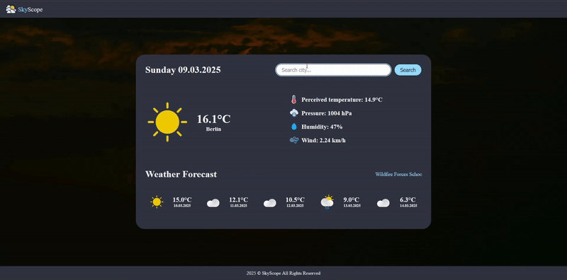
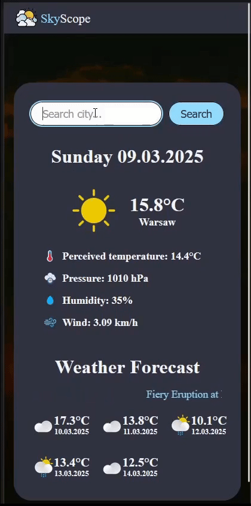

# 🌤️ SkyScope - Weather App

**SkyScope** is a responsive and user-friendly weather application that provides real-time weather updates and forecasts for any city worldwide. Built with HTML, CSS, and JavaScript and powered by the **OpenWeather API**, SkyScope offers a clean and intuitive interface to check current weather conditions, including temperature, humidity, wind speed and more, along with a 5-day weather forecast.

## 🌟 Features

- **Real-Time Weather Data**: Get current weather information for any city, including temperature, perceived temperature, humidity, pressure and wind speed.
- **5-Day Weather Forecast**: Plan ahead with a detailed 5-day weather forecast.
- **Responsive Design**: Works seamlessly on all devices, from desktops to mobile phones.
- **Dynamic Weather Icons**: Visual representation of weather conditions using custom icons.
- **Search Functionality**: Easily search for weather information by city name.
- **Modern UI**: A clean and minimalistic design with a dark theme for better readability.

## 🛠️ How to Use

1. **Get Your API Key**:
   - To use SkyScope, you’ll need an API key from [OpenWeather](https://openweathermap.org/api). Sign up for a free account and generate your API key.

2. **Set Up the Project**:
   - Clone this repository to your local machine:
     ```bash
     git clone https://github.com/GxbrielZ/SkyScope-WeatherApp.git
     ```
   - Navigate to the project directory:
     ```bash
     cd SkyScope-WeatherApp
     ```
   - Create `config.js` file and fill with this code:
     ```bash
     const CONFIG = {
       API_KEY: 'Your OpenWeather API KEY'
     };

3. **Run the Project**:
   - Open the `index.html` file in your preferred browser.
   - Alternatively, you can use a local server (e.g., Live Server in VS Code) to run the project.

4. **Search for Weather**:
   - Enter a city name in the search bar and hit "Search" to view the current weather and 5-day forecast.

## 📱 Preview

Here are some GIFs showcasing SkyScope in action:

- **Desktop View**:  
  

- **Mobile View**:  
  

## 🚀 Technologies Used

- **HTML**: For structuring the app.
- **CSS**: For styling and responsive design.
- **JavaScript**: For fetching and displaying weather data.
- **OpenWeather API**: For real-time weather data and forecasts.

Feel free to explore, contribute, or use SkyScope to stay updated on the weather! Don’t forget to ⭐ the repository if you find it useful!
